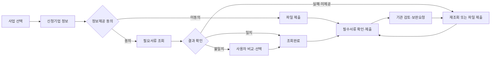

# 업무 목표와 요구사항 분석

분석 기준일: 2026-09-08. 제안요청서 원문, 운영매뉴얼, 지원기업 사용자매뉴얼 PDF, 공개 사이트 관찰을 대조했다.

## 이 사업이 달성하려는 업무

**지원기업이 필요한 전문가를 지역 경계 없이 찾고, 사업 신청서류를 적게 제출하며, 사업관리기관이 같은 정보로 매칭·서류·보완 현황을 관리하게 하는 사업**이다. 메인화면 개선은 이 업무에 접근하는 시간을 줄이는 역할이다.

| 업무 축 | 현행 자료에서 파악되는 불편 | 개선 목표 | 주 사용자 |
|---|---|---|---|
| 기술닥터 | 등록정보 갱신·분류·지역 간 활용 체계 개선 필요 | 최신 전문가 정보 → 복합 검색·비교 → 지역 간 매칭 → 기업지원 실적·통계 | TP 담당자, 지원기업, 관리자 |
| 메인·소통 | 공개 메인은 공고 카드 중심, 로그인은 별도 화면. FAQ·질문 접근성 개선 필요 | 메인 로그인 영역, 업무별 FAQ·관련답변 검색, 공개 질문·답변 노출, 배치 관리 | 비로그인 사용자, 지원기업, 관리자 |
| 증빙 간소화 | PDF p26의 접수서류는 서류별 파일첨부 중심 | 정보제공 동의 → 9종 행정정보 조회 → 입력값 확인 → 제출현황 → 실패·보완·재제출 | 지원기업, 사업관리기관 |

신청·협약·평가·지원이력 등 기존 RMS 전체를 새로 만드는 범위로 해석하지 않는다. 현행 업무 흐름 위에 제안요청서의 개선 기능을 붙이는 선행개발이다.

## 업무 흐름

## 기능 요구사항과 선행개발 대응

아래의 ‘시연’은 UI·가상 데이터 수준이다. 실제 인증·DB·기관 연계까지 완료했다는 의미가 아니다.

표는 반영 범위의 요약이다. SFR별 구체적인 디자인 컨셉, 화면 구성, 사용 기술, 브라우저 데이터 처리 및 실서비스 구현 계획은 [sfr-implementation.json](sfr-implementation.json)에서 관리하며 시연 안내 표와 비교 레이어에 동일하게 표시한다. 이 자료의 서버·DB 항목은 향후 구현 방안 설명이며 현재 DB 오브젝트를 생성하거나 백엔드를 구축한 결과물이 아니다. 각 메뉴 경로에는 허용된 시연 역할을 연결한다.

| 원문 ID | 요구사항 | 화면/시연 | 실제 사업에서 이어서 구현할 부분 |
|---|---|---|---|
| SFR-01 | 기술닥터 등록정보 현행화 | 검색·상세·등록/수정 팝업, SMTECH 가상 사용자 초기값, 중복/등록기관 권한, 변경이력, 12개월 현행화 대상 | SMTECH 사용자 조회, 실제 인적정보·기관권한·변경이력 테이블 |
| SFR-02 | 표준 분류체계 | 관리자에서 산업·기술·상담·기관·지역·선정사유 분류 관리, parentId 계층, 복수 선택 | 표준코드 확정, 기존 자유입력 데이터 정제·이행 |
| SFR-03 | 초광역권 통합검색 | 전국 검색, 등록지역/지원가능 지역 구분, 타지역 전문가 매칭 요청과 실적 | 지역 간 관리권한·요청전달·승인 규칙 |
| SFR-04 | 검색 고도화 | 이름·기관·취득기술, 산업·기술·기관유형·지역·연도 복합 검색, 정렬, 2~3명 비교 | 대량 검색·페이징·접근 가능한 필드 결정 |
| SFR-05 | 통계 관리 | 등록·활동 전문가, 매칭·지원완료·중복제거 기업 수, 지역/산업/기술/기간, CSV | 공식 집계 정의, 이력 시점 통계, 대량 엑셀 출력 |
| SFR-06 | 메인 로그인 영역 | 메인 로그인 패널/역할 선택 팝업, 로그인 전후 메뉴 | SMTECH 인증·휴대폰 OTP·세션·로그아웃 |
| SFR-07 | FAQ 검색·주요 질문 | 메인 주요 질문 펼침, 제목·답변·키워드, 부분/관련 글자 검색, 더보기 | 기존 FAQ 데이터, 검색 품질·관련도 기준 |
| SFR-08 | 업무유형 분류·검색 | 유형+검색어, 분류 사용/노출 설정, 기존 유형 일괄 매핑 | 기존 소통 분류 코드·데이터 매핑 검증 |
| SFR-09 | 최근 질문·답변 노출 | 공개·메인노출허용·활성 업무유형 조건, 제목/날짜/상태, 상세 모달 | 개인정보 제거·게시물 승인·서버측 공개 검사 |
| SFR-10 | 메인 정보 재배치·접근성 | 공고·FAQ·질문 위치/노출 관리, 키보드 조작·라벨·상태 텍스트 | 이용통계 분석, 공식 접근성·호환성 점검 |
| SFR-11 | 마이데이터 연계·간소화 | 동의/미동의, 일괄조회, 미제공·실패 시 단일 파일 대체 | 기관 연계, 동의 법정 문구·목적·보유기간, 암호화 |
| SFR-12 | 9종 서류 조회 | 서류별 상태·기관·조회시각, 사업별 필수 구분, 대상서류 추가·수정 | 실제 제공항목·기관 규격·만료/유효기간 |
| SFR-13 | 신청정보 반영 | 주소 불일치 대표 사례, 명시적 조회값 반영 또는 기존값 유지 | 전체 신청필드 매핑, 동일 정보의 사업 간 재사용 범위·재동의 |
| SFR-14 | 제출현황 관리 | 기업별/사업별 신청서 선택, 서류상태 필터, 기관의 보완요청 | 서버 검색·필터·권한·대량 목록, 보완 알림 |
| SFR-15 | 조회결과·보완관리 | 지연실패→재조회, 미제공→파일, 기관 보완→기업 재제출, 처리이력 | 오류코드·재시도·멱등성·기관 로그·장애 대응 |

SFR-13의 사업 간 동일 증빙 재사용은 현 시연에서 자동 처리하지 않는다. 사업별 동의 목적·유효기간이 확정되지 않은 상태에서 다른 신청서의 동의·조회값을 자동 복사하지 않는 설계다. 기술닥터 학위/경력/자격증/취득기술은 화면 검토를 위한 텍스트 입력이며, 운영에서는 반복 테이블 구조로 정규화해야 한다.

## 9종 증빙서류

1. 사업자등록증명서
2. 폐업사실증명서
3. 휴업사실증명서
4. 표준재무제표증명서
5. 국세 납세증명서
6. 지방세 납세증명서
7. 부가가치세 과세표준증명
8. 중소기업확인서
9. 4대 사회보험료 완납 증명서

9종 전부가 모든 사업의 필수는 아니다. `programs[].requiredDocs`로 사업별 필수요건을 구분한다. 서류 추가/중지와 사업별 필수목록 변경은 운영 연계 시 함께 검증해야 한다.

## 중요한 처리 규칙

- 다른 TP에 등록된 기술닥터는 조회만 한다. 시스템 관리자의 예외 수정권한은 시연 가정이므로 운영 권한표에서 승인 여부를 확정한다.
- 정보제공 동의 없이 마이데이터 조회를 실행하지 않는다. 파일 제출 경로는 제공한다.
- 불일치 정보는 자동 덮어쓰지 않는다. 반영/유지 선택과 처리이력을 남긴다.
- 메인에는 공개 가능한 게시물 중 노출허용된 글만 보인다. 메인 노출을 해제해도 공개 게시물 전체 목록에서는 조회할 수 있다.
- 제출 후 임시저장/재조회/첨부 등 수정은 잠그고 기관 보완요청 후 다시 편집한다. 상세 운영 정책은 발주기관과 확정한다.
- 지원완료 실적과 지원기업 수를 구분하고, 중복 기업은 ID로 제거한다.

## 전체 요구사항 범위와 원문 오류

원문 총괄은 **70건**이나 상세 블록은 **71건**이다. `COR-02`가 ‘표준 프레임 워크 적용’과 ‘기존 시스템 호환’에 중복되어 있다. 원문 ID를 보존하고 내부 관리키를 `COR-02`, `COR-02#2`로 구분했다.

| 구분 | 상세 건수 | 이번 결과물의 대응 |
|---|---:|---|
| 기능 SFR | 15 | 주요 화면·가상 흐름 시연 |
| 성능 PER | 3 | 구조 고려, 실제 부하/3초 성능검증은 내부 환경에서 수행 |
| 인터페이스 SIR | 2 | HTML·CSS·JS 및 기본 접근성 설계, 공식 점검은 별도 |
| 데이터 DAR | 3 | 가상 JSON 모델·분류 구조, 실DB 설계·이행 제외 |
| 테스트 TER | 4 | 선행개발 회귀검증, 운영 통합/인수검사 제외 |
| 보안 SER | 11 | 실제 정보/인증 미사용, 납품 보안절차·진단 별도 |
| 품질 QUR | 5 | 기능 품질 검증, 계약상 전체 품질보증 별도 |
| 제약 COR | 10 | 원본 소스 보존·JSP 이식 고려, 실제 환경 확인 필요 |
| 관리 PMR | 14 | 추적표·인계 자료, 사업관리 산출물 전체를 대체하지 않음 |
| 지원 PSR | 4 | 실행·시연 안내, 운영교육·유지보수 별도 |

전체 원문과 근거 위치는 [요구사항 색인](../reference/documents/requirements-index.md), [상세 JSON](../reference/documents/requirements-catalog.json), [세부 업무분석](../reference/documents/requirements-analysis.md)을 참조한다. HWP 추출은 본문 텍스트/표 문단 기준이며 이미지 내부 내용은 포함되지 않는다.
